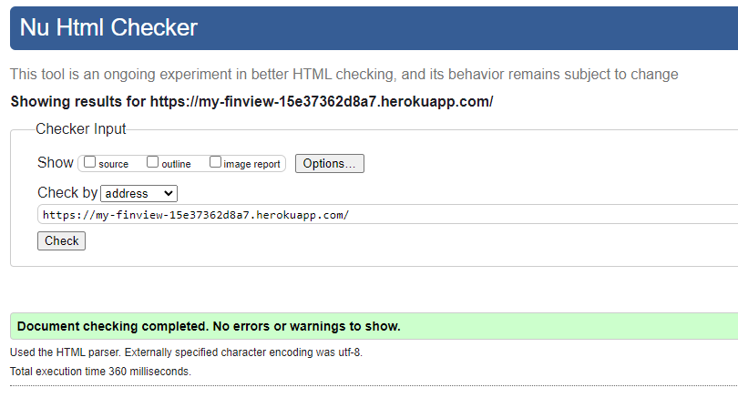
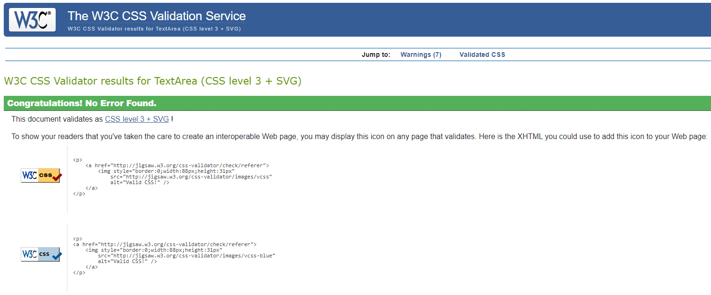
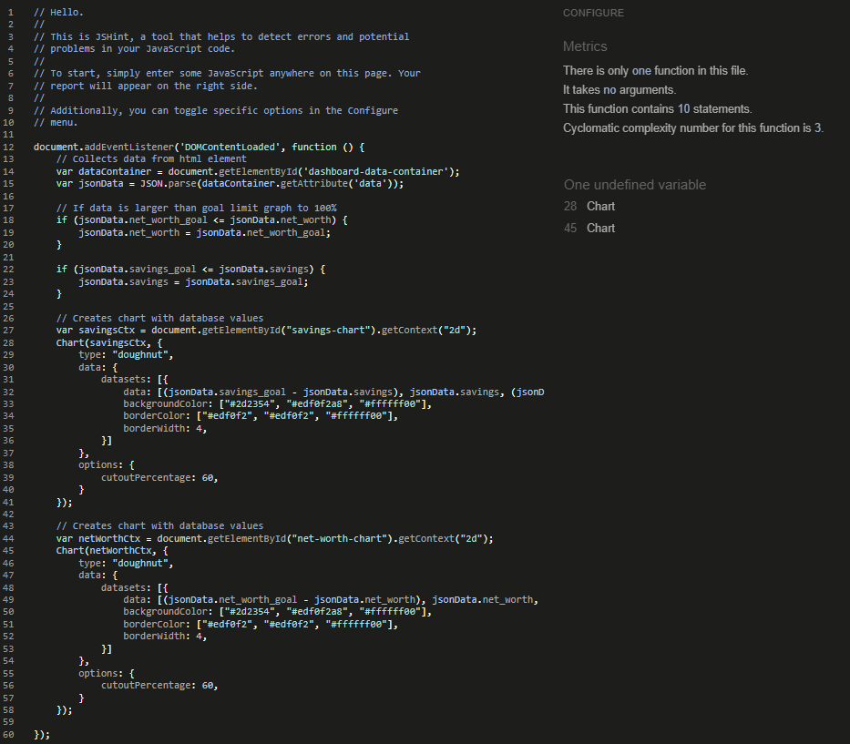
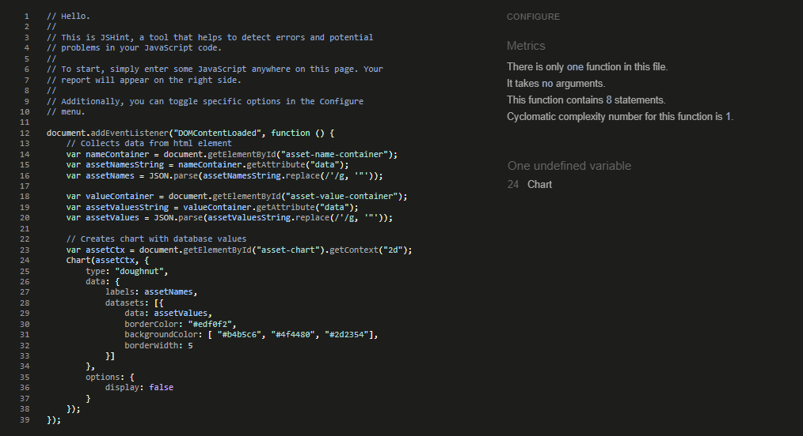
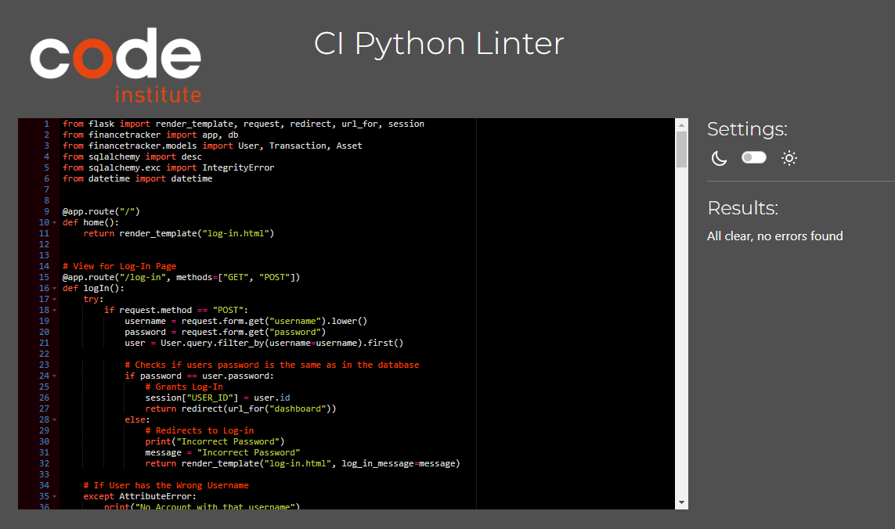

# FinView

## Purpose of the Project

**Description:**

Welcome to FinView! FinView is a web-based finance tracking application that simplifies its users' lives by organizing, tracking, and displaying their salary, assets, and transactions.
FinView is designed to provide goals and targets to its users, making saving and managing your wealth more obtainable!

**Set Your Goals:** 

When registering as a user, you have the ability to choose your goals. The selected goals then become your targets.

**Add Transactions:** 

When adding transactions, FinView will automatically keep track and integrate any changes in your progress towards your goals. This helps to visualize your progress and motivates its users.

**Add Assets:** 

Adding assets is similar to adding transactions; these assets accumulate and contribute to your net worth, allowing you to assess and visualize all aspects of your financial life.

### Why This Project:

FinView is a web-based finance tracking application developed to simplify users' financial management by offering goal-oriented features, automated tracking, and integration of transactions. Upon registration, users can set goals that become their targets, fostering a structured approach to wealth management. The platform's automated tracking system ensures real-time progress updates, facilitating visualization and motivation for users. Additionally, FinView includes asset management features, allowing users to accumulate assets and assess their net worth comprehensively. The project aims to streamline financial tasks, promote goal achievement, and provide users with a holistic view of their financial situation, enhancing overall financial well-being.

### Project Objectives:

- *Functioning Registration:* Develop a registration system that effectively collects users' information and goals and stores that information in a database.

- *Functional Log-In:* Create a captivating login screen that thoroughly checks if the user's information is correct and existing. If so, granting access to the rest of the website.

- *Insertion and Deletion of Transactions:* Implement a system that allows users to enter their recent financial transactions, prompting for information such as category and amount. Display the entered transactions in a visually appealing format. Allow users to delete any incorrectly entered transactions.

- *Asset Management and Tracking:* Implement a system that allows users to enter their personal assets, prompting for information such as the asset's name and value. Keep track of the combined asset value of all assets and display the relevant information, allowing users to filter and view assets as needed.

- *Visualization of Financial Goals:* Create appealing charts that help represent all the users' data as well as goals, aiding them in actively keeping track of their financial information.
  
## User Stories

### Current User Stories:

1. **As a new user**, I want to easily register on FinView by providing my information and selecting financial goals, so that I can effectively manage my wealth.

2. **As a registered user**, I want to experience a captivating login screen that verifies my information, granting access to the website if it is correct, ensuring a secure and user-friendly login process.

3. **As a wealthy individual**, I want to be able to track a diverse portfolio of assets and investments effectively. The system should be able to display a high volume of transactions.

4. **As a user in debt**, I want to see visually appealing charts that represent my financial data and goals, enabling me to actively monitor and track my progress towards achieving my financial objectives.

5. **As a user climbing the corporate ladder**, I want the ability to delete any incorrectly entered transactions, ensuring the accuracy of my financial records. I also want the ability to change my ever-changing salary.

### Future User Stories:

1. **As a user with international financial activities**, I want the ability to input transactions in multiple currencies and have the system automatically convert and display the values in my preferred currency.

2. **As a user**, I want the system to provide personalized financial insights and tips based on my spending patterns, helping me make informed decisions for budgeting and savings.

3. **As a user**, I want the option to categorize my expenses into predefined categories or create custom categories, providing me with a more detailed breakdown of my spending habits.

## Features

### Key Features:

- **Registration:** Allows users to become members of the website, disabling any incorrect inputs.

- **Log-In:** Allows users to enter their individual accounts, validating information and displaying error messages if any of the information is incorrect.

- **Navigation:** Easy-to-use navigation for a seamless user experience while navigating the website. This feature displays navigation links, guiding you to each individual section of the website, along with the website name and log-out button.

- **Dashhboard:** Displays most of the users' information in a quick and easy-to-look-at format. Only the five most recent transactions are shown here.

- **Income & Expenses:** Showcases the user's salary and provides a form screen, allowing users to perform CRUD (Create, Read, Update, Delete) functionality on transactions and salary.

- **Assets:** In the footer, users can find copyright information and contact details. The platform also offers a form screen, enabling users to perform CRUD (Create, Read, Update, Delete) functionality on their assets.

- **All Transactions:** Allows users to view all their transactions.

## Future Features

### Planned Future Features:

- Implement tips on how to be more financially responsible.
- Be able to sort transactions based on amount or category.
- Automatically keep track of an assets value.

## User Experience Design Features

### Typography:

- **Primary Font:**  *Rubik*, chosen for its versatility and readability, enhances the overall UI and UX experience. With a clean and modern appearance, Rubik ensures a seamless and pleasant reading experience across various screen sizes. Its balanced letterforms and legibility make it an excellent choice for body text and user interface elements.

- **Secondary Font:** *Sans-Serif*, I chose sans-serif as my secondary font because it is a basic font that is universally supported across all browsers. In the event that my main font fails to load for any reason, I can rely on and depend on sans-serif as a fallback option.

### Color Scheme:

- **Primary Color:**  *#474471*, carefully chosen for its visual appeal and functionality, contributes to an enhanced UI and UX experience on the website. This deep, muted shade of purple possesses a richness that can add a touch of sophistication and depth to various interface elements. Its darker tone makes it effective for creating contrasts and emphasizing certain components, improving overall readability and navigation. The color choice aligns with the website's aesthetics, fostering a cohesive and visually pleasing design.
  
- **Secondary Color:** *#edf0f2* has been thoughtfully selected to enhance the website's UI and UX. This soft, neutral shade serves as an excellent choice for text and borders due to its high contrast with darker backgrounds, ensuring readability and clarity. The lightness of this color promotes a clean and modern aesthetic, contributing to a user-friendly and visually pleasing experience.

## Wireframes

### Wireframes:

- **Log In Section Wireframe:** 

- **Dashboard Section Wireframe:** 

- **Income & Expenses Section Wireframe:** 

## Technologies

### Languages:

- **HTML:** Used to structure the contents for my website.
- **CSS:** Used to style the content of my website.
- **JavaScript:** Used to add the interactivity to the charts.
- **Python:** Used for the back-end and data management.
- **PostgreSQL:** Used as the database for the website.

**Frameworks and Add-Ons:**

- **Flask:** Web Developent framework for Python.
- **SQLAlchemy:** Object-Relational Mapping (ORM) library for Python
- **Bootstrap:** Used to make the website scalable across multiple screen sizes.
- **Chart.js:** Used to create the graphs on my website.
- **Google Fonts:** Used to apply non-included fonts onto my text.

**Additional:**

- **GitPod:** My Integrated Development Environment.
- **Git and Github:** Used Git for source code management and github for version control.
- **Heroku:** For deployment of my website.
- **ElephantSQL:** Cloud-based PostgreSQL database service that I used to host my database.

## Testing

### W3C Validator:

- ***HTML*** 

### Jigsaw Validator:
- ***CSS*** 

### JSHint:
- ***JavaScript Dashboard*** 

### JSHint:
- ***JavaScript Asset*** 

### JSHint:
- ***Python*** 

### Manual Testing:

| Feature                      | Action                                | Expected Result                    | Tested | Passed  | Comments   |
| ---------------------------- | ------------------------------------- | ---------------------------------- | ------ | ------- | ---------- |
| Dashboard Navigation         | Click on the 'Dashboard' link         | Redirect to Dashboard page         | ✅     | ✅     | Works Fine |
| Income & Expenses Navigation | Click on the 'Income & Expenses' link | Redirect to Income & Expenses page | ✅     | ✅     | Works Fine |
| Assets Navigation            | Click on the 'Assets' link            | Redirect to Assets page            | ✅     | ✅     | Works Fine |
| Log Out button               | Click on the 'Log Out' Button         | Redirect to Log In page            | ✅     | ✅     | Works Fine |
| View All Transactions Page   | Click on the 'View All' button        | Redirect to All Transactions page  | ✅     | ✅     | Works Fine |
| Form Submits                 | Click on the 'Submit' buttons         | Redirect to relevant pages         | ✅     | ✅     | Works Fine |
| Register Page Form           | Fill register form out and submit     | If fields not empty it redirects   | ✅     | ✅     | Works Fine |
| Log In Page Form             | Fill Log In form out and submit       | If fields not empty it redirects   | ✅     | ✅     | Works Fine |
| Savings Goal Chart           | Add transaction income & earning      | Chart updates based on transaction | ✅     | ✅     | Works Fine |
| Net Worth Goal Chart         | Add an asset or change salary         | Chart updates based on assets      | ✅     | ✅     | Works Fine |
| Asset Chart                  | Dispalys all assets and amounts       | Dispalys all assets and amounts    | ✅     | ✅     | Works Fine |
| Total Asset Value number     | Add an asset or delete an asset       | Number updates based on assets     | ✅     | ✅     | Works Fine | 
| Savings number               | Add transaction income & earning      | Number updates based on transaction| ✅     | ✅     | Works Fine |
| Net Worth number             | Add an asset or change salary         | Number updates based on assets     | ✅     | ✅     | Works Fine |
| Salary Circle                | Click "Edit Salary" and submit salary | Salary Circle updates to new salary| ✅     | ✅     | Works Fine |
| Add Transaction              | Click and fill out the form           | If fields not empty it submits     | ✅     | ✅     | Works Fine |
| Delete Transaction           | Click and fill out the form           | If fields not empty it submits     | ✅     | ✅     | Works Fine |
| Add Asset                    | Click and fill out the form           | If fields not empty it submits     | ✅     | ✅     | Works Fine |
| Delete Asset                 | Click and fill out the form           | If fields not empty it submits     | ✅     | ✅     | Works Fine |

### Fixed Bugs:

1. **Negative Savings and Net Worth Goal:** When registering as a user on the website, you are required to enter a "Savings Goal" and a "Net Worth Goal." I discovered that if users enter a negative number or zero, the charts won't display correctly. To address this issue, I added extra validation during registration in the form of an if-else statement: ***if int(net_worth_goal) <= 0:*** and ***elif int(savings_goal) <= 0:*** . This resolution ensures that users cannot input non-positive values for these goals, preventing potential issues with chart display.

### Supported Screen Sizes:

- **For Small, Medium and Large Phone Screen Sizes:** (Breakpoint: 320px to 576px).
- **For Small and Medium Tablet Sizes:** (576px to 768px).
- **For Small and Medium Laptop Screen Sizes:** (768px to 992px).
- **For Large Laptop and Small Desktop Screen Sizes:** (992px to 1200px).
- **For Large Desktop Screen Sizes:** (1200px +).

## Deployment

The Site was Deployed on Heroku. This is the link <https://my-finview-15e37362d8a7.herokuapp.com/>